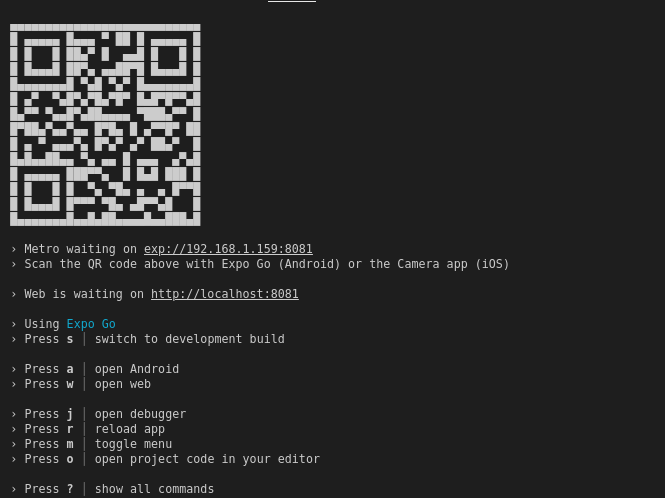
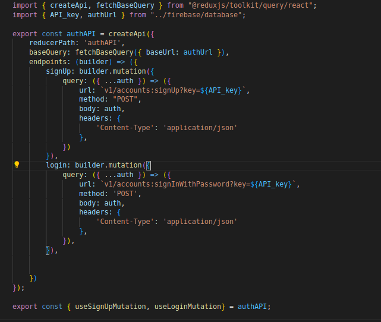

# Guuitar Store

Guitar store es una aplicación movil desarrollada con react native y el framework expo go.En sistesis, es la base para una aplicación de eComerce con lógica de compras(agregar al carrito, comprar y obtener la orden de compra; agregar productos a favoritos; registro e inicio de sesión y carga de una foto de perfil de usuario)


## instalación 

```terminal
git clone https://github.com/javiscripto/coderApp
cd coderApp
npm install

```
## correr la aplicacion:

Para correr la aplicación puedes hacerlo simplemente con  
```terminal
npm start
```
o
```terminal
npm run expo start
```

Esto deberia mostrar una imagen similar a esta:



Si deseas ver los cambios que realices en el código puedes verlos en tu dispositivo movil escaneando el código qr o, si dispones de un emulador en tu máquina, presionar la tecla "a" para cargar la aplicación en el emulador de android studio. 


## uso 
Esta aplicación interactua con RTDB de firebase y el servicio de autenticación para el registro de usuarios mediante @reduxjs/toolkit. Las querys (GETs) y mutations (POST, PUT) estan disponibles en la carpeta "services".
Si deseas realizar pruebas con tu propia instancia rtdb, necesitaras proporcionar una api key, una baseUrl y proporcionar algunos parametros adicionales para poder realizar las solicitudes http.

ejemplo authService:



- la solicitud para cargar una imagen a rtdb se envia con el método put para no crear un recurso adicional asi, si el recurso no existe, se crea y si ya existe, solo se actualiza. Además, dicha solicitud recibe como cuerpo la imagen codificada en base64

```
    saveProfileImage: builder.mutation({
            query: ({ image, localId }) => ({
                url: `profileImages/${localId}.json`,
                method: "PUT",
                body: { image },
            })
        }),

```
- para poder consultar los datos a tu instancia rtdb necesitaras modificar sus reglas (consultar documentacion reglas rtdb )
